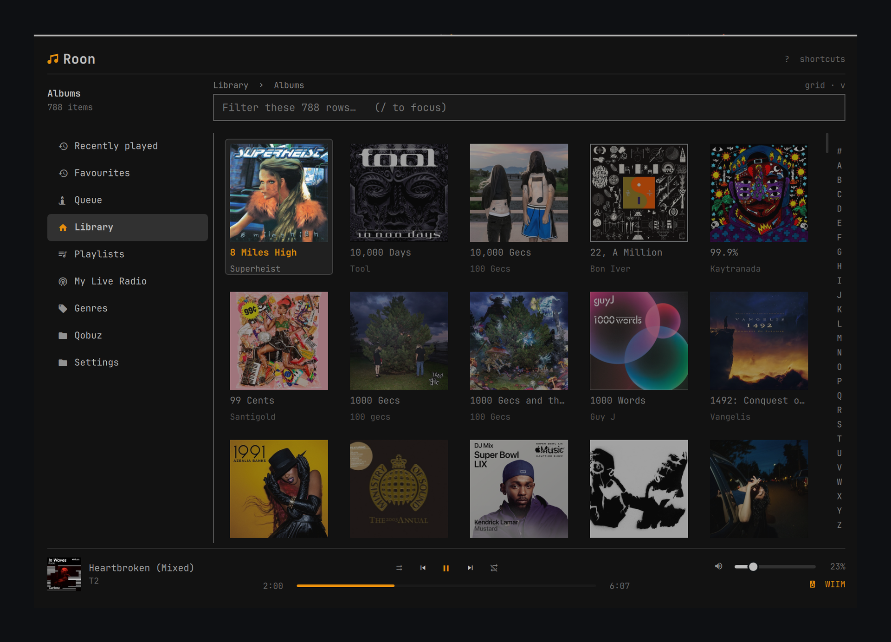

# Roon for Omarchy

Control and browse a [Roon](https://roon.app) core from the Omarchy bar.



- Bar widget with a now-playing panel: artwork, seek, transport, volume, zone
  switching, per-output trim and grouping.
- Full-screen library browser. Categories on the left, content on the right,
  cover grid where it suits. Albums and artists get their own screen.
- Media keys, `playerctl` and Omarchy's media widget all work, because the
  plugin publishes the active zone on D-Bus as an MPRIS player.
- Recently played and Favourites, kept locally. Roon exposes neither.
- Output format read from the speaker, since Roon does not report it.

## Requirements

- Omarchy 4.0 or later
- A Roon core on the same network
- Python 3.11+

## Install

```sh
omarchy plugin add https://github.com/jesse-chelin/omarchy-roon.git
omarchy plugin enable io.github.jesse-chelin.roon
```

Then authorise it once in Roon: **Settings → Extensions → Enable "Omarchy"**.
The widget shows the pairing steps until you do.

The bridge runs in its own virtualenv, built on first launch. Arch marks the
system Python externally-managed, and the shell should not depend on whatever
is on `PATH`. Dependencies are `roonapi`, `websocket-client` and `jeepney`,
all pinned exactly in `bridge/requirements.txt`.

## Uninstall

```sh
omarchy plugin remove io.github.jesse-chelin.roon
```

Three things live outside the plugin folder and are left in place, so that
reinstalling does not cost you the pairing or the history:

| Path | Contents |
|------|----------|
| `$XDG_STATE_HOME/omarchy-roon/` | virtualenv, auth token (`session.json`, mode 0600), recently played, favourites |
| `~/.config/omarchy-roon/endpoints.json` | zone-to-speaker overrides, if you wrote any |
| `~/.config/hypr/bindings.conf` | keybindings, if you installed them |

To remove those too:

```sh
rm -rf "${XDG_STATE_HOME:-$HOME/.local/state}/omarchy-roon"
rm -f  "$HOME/.config/omarchy-roon/endpoints.json"
```

The extension stays registered on the core until you remove it there:
**Roon → Settings → Extensions → Omarchy → Remove**.

No system files are written, no services are installed, and `sudo` is never
used.

## Keybindings

Media keys work without configuration. For the two surfaces:

```sh
omarchy-roon keybindings            # print them
omarchy-roon keybindings --install  # append to ~/.config/hypr/bindings.conf
```

## Settings

Open the panel and click the gear. Settings are stored in the widget's entry
in `~/.config/omarchy/shell.json` and can also be edited there directly.

| Key | Default | Meaning |
|-----|---------|---------|
| `core` | `""` | Core host or IP. Blank auto-discovers. |
| `maxLabelWidth` | `200` | Width in px before the bar label scrolls. |
| `showWhenIdle` | `false` | Keep the track name in the bar when nothing is playing. |
| `closeBrowserAfterAction` | `true` | Dismiss the browser after Play Now. |
| `showOutputFormat` | `true` | Ask the speaker what it is decoding. Involves LAN requests to third-party devices. |
| `showProgress` | `true` | Progress line under the bar label. |
| `showArtInBar` | `true` | Album art instead of a glyph in the bar. |
| `reduceMotion` | `false` | Stop the marquee, pulses and fades. |
| `keepHistory` | `true` | Keep the recently-played log and favourites. |
| `volumeOsd` | `true` | Show volume changes on Omarchy's OSD. |
| `discoverySweep` | `true` | If the broadcast search fails, look for the core by connecting to port 9330 on hosts in your own subnet. |
| `trackOsd` | `false` | Show an OSD on every track change. |

Set `core` when discovery fails. Roon uses multicast, which does not cross
VPNs, VLANs or a NAT'd VM.

## Mouse and keys

**Bar widget**

| Input | Action |
|-------|--------|
| Left click | Open the panel |
| Right click | Play/pause |
| Middle click | Next track |
| Scroll | Volume |

**Browser**

| Key | Action |
|-----|--------|
| `Tab` | Switch panes |
| `j` `k`, arrows | Move the cursor |
| `Enter` | Open, or run the highlighted action |
| `Backspace` | Back one level |
| `g` | Jump to the category list |
| `1`-`9` | Open the nth row |
| `Alt`+`A`-`Z` | Jump to a letter in a long list |
| `s` | Search the library and connected catalogues |
| `/` | Filter the rows on screen |
| `v` | Grid or list |
| `f` | Favourite the current album |
| `x` | Clear the recently-played log |
| `p` | Play or pause |
| `[` `]` | Previous or next track |
| `,` `.` | Seek ten seconds |
| `-` `=` | Volume |
| `m` | Mute |
| `z` | Play in the next room |
| `?` | Show all of the above |
| `Esc` | Close |

`?` is generated from the same list the browser dispatches on, and a test
asserts the two agree.

## CLI

```sh
omarchy-roon status          # active zone as JSON
omarchy-roon zones           # zone names
omarchy-roon zones-json      # full zone state
omarchy-roon play-pause
omarchy-roon next | previous
omarchy-roon volume-up | volume-down | mute
omarchy-roon zone "Kitchen"  # choose the zone the widget controls
omarchy-roon panel           # open the now-playing panel
omarchy-roon browse          # open the library browser
omarchy-roon search "term"
omarchy-roon history         # recently played, as JSON
omarchy-roon restart         # restart the bridge
```

## How it works

Omarchy's shell ships no `QtWebSockets` QML module, and Roon speaks its own
protocol over a WebSocket, so QML cannot reach a core directly. A Python
bridge sits between them.

```
omarchy-shell (Quickshell)                    bridge/roon_bridge.py
┌───────────────────────────┐   NDJSON over  ┌──────────────────────┐
│ Service.qml   (state)     │◄──── stdio ───►│ roonapi              │◄──► Roon core
│ BarWidget.qml (bar+panel) │                │ discovery, auth,     │
│ Browser.qml   (overlay)   │                │ zones, browse        │
└───────────────────────────┘                └──────────────────────┘
```

One bridge process per shell, not one per bar or per monitor, so the token,
zone state and browse position stay consistent across every surface. Commands
go down as one JSON object per line. Zone snapshots, browse levels and status
come back the same way and are pushed rather than polled. The bridge restarts
with a 5s backoff if it dies, and reconnects if the core goes away.

Album art is an HTTP URL on the core, so QML loads it directly without the
images passing through the bridge.

## What Roon does not expose

Established by dumping the payloads from a live core, not from documentation.

| Missing | Consequence |
|---------|-------------|
| Format and signal path | The output format is read from the speaker over the LAN instead. WiiM, Sonos, BluOS and generic UPnP are supported. |
| Play history | Recently played is the plugin's own log, kept on this machine. |
| Favourites | Same. There is no favourites hierarchy in the browse tree, and an album's actions are Play Now, Add Next, Queue and Start Radio. |
| Date added | No "recently added" view is possible. |
| Queue editing | `play_from_here` is the only queue verb, so a track can be jumped to but not removed. |

Anything labelled "this plugin's own" will not appear in the Roon app.

## Troubleshooting

**`roonapisocket -- Connection is not (yet) ready!` at startup.** Harmless.
The bridge works around it.

**No core found, and the core is on another machine.** Almost always ufw.
Omarchy enables it with `default deny incoming` on every install. Roon answers
the discovery broadcast from port 9003, but the reply arrives on a random
ephemeral port, so `default deny incoming` drops it.

The obvious rule does not work:

```sh
sudo ufw allow 9003/udp        # opens the DESTINATION port. The reply is not addressed to it.
```

Allow it by source port instead:

```sh
sudo ufw allow proto udp from 192.168.1.0/24 port 9003
```

Or skip discovery entirely by setting `core` to the address.

Since 1.0.1 the plugin also looks for the core directly when the broadcast gets
no answer, which works through the firewall because outbound TCP is permitted.
That covers the common case without any rule. See `discoverySweep` above and
the Security section below.

**No core found, on the same machine as the core.** Set `core` to `localhost`.

**Wrong speaker matched for the output format.** Zones are matched to devices
by name. Override it in `~/.config/omarchy-roon/endpoints.json`:

```json
{ "Bedroom speaker": "192.168.1.31" }
```

**Media keys do nothing.** `jeepney` is missing from the venv. Re-run
`install.sh`. The plugin logs the reason and carries on without MPRIS.

**Nothing works after a Python upgrade.** Re-run `install.sh` to rebuild the
virtualenv.

## Development

```sh
./check.sh
```

Manifest validation, `qmllint` against the shell's imports, QML unit tests,
two structural guards and the Python tests. This is what CI runs. Steps needing
the Omarchy shell skip themselves when it is absent.

The structural guards exist because their failure modes are silent.
`test_bridge_structure.py` catches a method defined twice in one class, which
Python accepts. `test_qml_structure.py` catches a property bound twice in one
object, which `qmllint` accepts and the QML engine rejects at load, removing
the widget from the bar with no error anyone sees.

| File | Responsibility |
|------|----------------|
| `Service.qml` | The bridge process, shared state, IPC |
| `Browser.qml` | Browser state and navigation |
| `ContentPane.qml` | Cover grid and row list |
| `DetailPane.qml` | Albums and artists |
| `AlphabetRail.qml` | A-Z jump |
| `NowPlayingBar.qml` | The browser's player bar |
| `BrowserToolbar.qml` | Heading, breadcrumb, view toggle, both text boxes |
| `KeyboardHelp.qml` | The `?` reference |
| `FocusArbiter.qml` | Keyboard focus arbitration, unit-tested |
| `BarWidget.qml` | The bar item |
| `PlaybackPanel.qml` | The now-playing panel |
| `SetupGuide.qml` | Onboarding |
| `bridge/roon_bridge.py` | Roon connection, browse, queue, history |
| `bridge/mpris.py` | MPRIS on D-Bus |
| `bridge/endpoints.py` | Speaker discovery and format probing |

Both text boxes live in one component because they compete for keyboard focus,
and that competition caused three separate bugs.

## Security

The plugin runs unsandboxed, like every Omarchy plugin. It:

- stores a Roon auth token at `$XDG_STATE_HOME/omarchy-roon/session.json`. That
  file is 0600 and the directory is 0700, both set explicitly rather than left
  to the umask. The history and favourites files are 0600 as well.
- makes HTTP requests to audio devices on the local network when
  `showOutputFormat` is on. Responses are capped at 256 KiB.
- opens TCP connections to port 9330 on hosts in your own subnet, but only when
  the broadcast search has already failed and only on directly attached /24s or
  smaller. One pass, 350ms per host, no retries. Turn it off with
  `discoverySweep` if you would rather set the core address by hand.
- publishes an MPRIS player on the session bus
- installs a hash-pinned set of Python packages from PyPI into a private
  virtualenv (`bridge/requirements.lock`)

Its own state files are read without following symlinks and with a size limit,
and written through an unpredictable temporary name that is private before it
holds any bytes.

It does not use `sudo`, write system files, install services, or send anything
off the local network.

## License

MIT. See [LICENSE](LICENSE).
